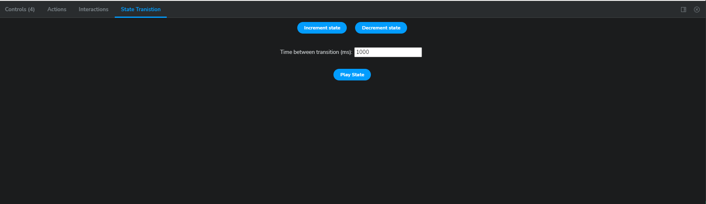

# Storybook Addon State Testing

Visually test state transitions

### Development scripts

- `yarn start` runs babel in watch mode and starts Storybook
- `yarn build` build and package your addon code

### Setup in other projects/stories

Install the addon

```bash
npm install storybook-state-addon
```

Register the addon in .storybook/main.js

```js
"addons": [
    ...
    "storybook-state-addon"
  ],
```

### When you run Storybook, you should see a `State Transition` panel in the addons panel.



### Usage

In your stories, use `parameters` to pass a `stateMachine` array to the addon. The array should contain objects that represent Storybook args (component props) for different states you want to test. You can transition through state manually my clicking the `Increment state` and `Decrement state` buttons in the `State Transition` panel. You can also play all the state transitions automatically by clicking the `Play State` button which will trigger all state transition automatically from the beginning with a delay (the delay is in milliseconds specified in the input field).

```js
parameters: {
    stateMachine: [
      { label: "State 1" },
      { label: "State 2" },
      { label: "State 3" },
    ],
  },
```

### Example

```js
import type { Meta, StoryObj } from "@storybook/react";

import { Button } from "./Button";

// More on how to set up stories at: https://storybook.js.org/docs/react/writing-stories/introduction#default-export
const meta: Meta<typeof Button> = {
  title: "Example/Button",
  component: Button,
  },
};

export default meta;
type Story = StoryObj<typeof Button>;

// More on component templates: https://storybook.js.org/docs/react/writing-stories/introduction#using-args
export const Primary: Story = {
  // More on args: https://storybook.js.org/docs/react/writing-stories/args
  args: {
    primary: true,
    label: "Button",
  },
  parameters: {
    stateMachine: [
      { label: "State 1" },
      { label: "State 2" },
      { label: "State 3" },
    ],
  },
};
```
